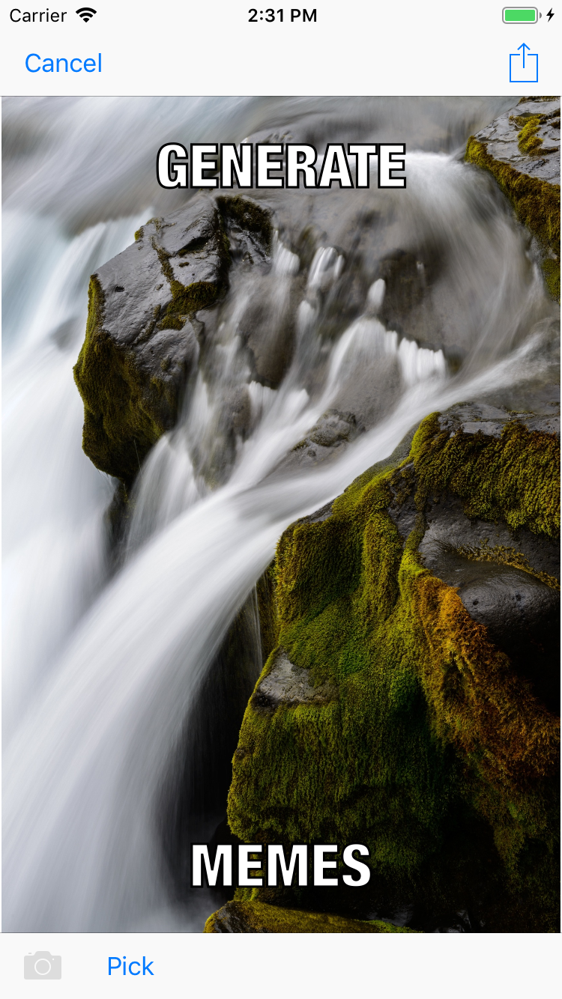
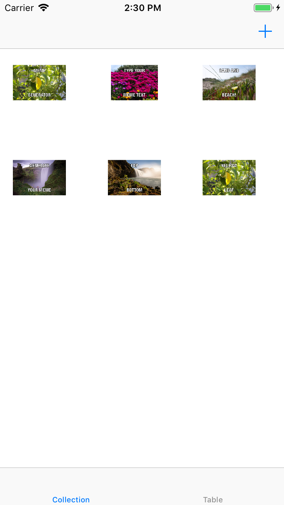
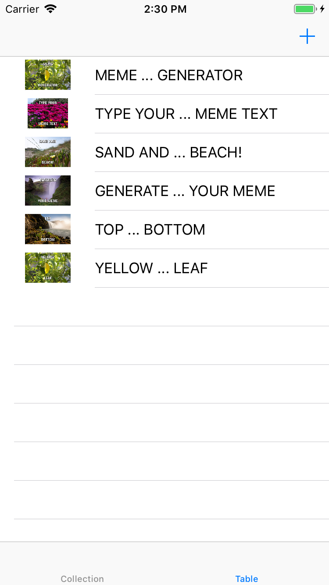

# Meme

An iOS app that allows you to create a meme from images in your iPhone gallery, save it and share it with friends.

## Technologies Used:

UITableView
UICollectionView
UINavigationController

## Build

This app was build in Swift 4.0 and Xcode 9

## Screenshots

   
